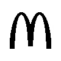
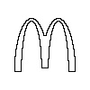

<center><h3>图像分割作业</h3></center>

<center>3190103683 张嘉浩</center>

#### 1. 实验要求

- 用一种方法实现图像前景、背景分割，并提取前景区域边缘；
- 给出灰度图像、分割后二值化图像、边缘提取结果图像，以及边缘的链码表示；
- 上述结果可以是运行结果截屏图像，同时，提交核心代码。

#### 2. 实验步骤

##### 2.1 otsu 实现图像分割

otsu法（大津法）是阈值化中常用的自动确定阈值的方法之一。Otsu法确定最佳阈值的准则是使阈值分割后各个像素类的类内方差最小。另一种确定阈值的准则是使得阈值分割后的像素类的类间方差最大。这两种准则是等价的，因为类间方差与类内方差之和即整幅图像的方差，是一个常数。分割的目的就是要使类别之间的差别最大，类内之间的差别最小。

设图像总像素数为$N$，灰度级总数为$L$，灰度值为i的像素数为$N_i$。令$\omega(k)$和$μ(k)$分别表示从灰度级0到灰度级k的像素的出现概率和平均灰度，分别表示为：
$$
w(k)=\sum_{i=0}^{k}\frac{N_i}{N}\\
\mu(k)=\sum_{i=0}^{k}\frac{i\cdot N_i}{N}
$$
由此可见，所有像素的总概率为$ω(L-1)=1$，图像的平均灰度为$μ_T=μ(L-1)$。 

设有*M*-1个阈值($0≤t_1＜t_2＜…＜t_{M-1}≤L-1$)，将图像分成$M$个像素类$C_j$($C_j\in［t_{j-1}+1,…,t_j$］； $j=1,2,…,M$； $t_0=0$，$t_M=L-1$)，则$C_j$的出现概率$ω_j$、平均灰度$μ_j$和方差$\sigma_j^2$为

$$
\omega_j=\omega(t_j)-\omega(t_{j-1})\\
\mu_j=\frac{\mu(t_j)-\mu(t_{j-1})}{\omega(t_j)-\omega(t_{j-1})}\\
\sigma_j^2=\sum_{i=t_{j-1}+1}^{t_j}(i-\mu_j)^2\frac{\omega(i)}{\omega_j}
$$

由此可得类内方差，类间方差为

$$
\sigma_W^2(t_1,t_2, …,t_{M－1})=\sum_{j=1}^{M}\omega_j*\sigma_j^2\\
\sigma_B^2(t_1,t_2, …,t_{M－1})=\sum_{j=1}^{M}\omega_j*(\mu_j-\mu_T)^2
$$

将使$(*)$式最小或使$(\#)$式最大的阈值组($t_1,t_2, …,t_{M－1}$)作为M阈值化的最佳阈值组。若取$M$为2，即分割成2类，则可用上述方法求出二值化的最佳阈值。

代码实现如下：

```python
hist_norm = hist.ravel()/hist.sum()
Q = hist_norm.cumsum()
bins = np.arange(256)
fn_min = np.inf
thresh = -1
for i in range(1, 256):
    p1, p2 = np.hsplit(hist_norm, [i])  # probabilities
    q1, q2 = Q[i], Q[255]-Q[i]  # cum sum of classes
    if q1 < 1.e-6 or q2 < 1.e-6:
        continue
    b1, b2 = np.hsplit(bins, [i])  # weights
    # finding means and variances
    m1, m2 = np.sum(p1*b1)/q1, np.sum(p2*b2)/q2
    v1, v2 = np.sum(((b1-m1)**2)*p1)/q1, np.sum(((b2-m2)**2)*p2)/q2
    # calculates the minimization function
    fn = v1*q1 + v2*q2
    if fn < fn_min:
        fn_min = fn
        thresh = i
# find otsu's threshold value with OpenCV function
ret, otsu = cv2.threshold(blur, 0, 255, cv2.THRESH_BINARY+cv2.THRESH_OTSU)
```

##### 2.2 基于8方向码轮廓跟踪

**STEP1** 首先从上到下、从左到右顺序扫描图像，寻找第一个目标点作为边界跟踪的起始点，记为$\text{A}$，为最左角上的边界点。定义搜索方向变量 `dir`，初始化为 `dir=5`。若不是边界点，则逆时针旋转搜索方向，更新 `dir=(dir+1) mod 8` 直到搜索到边界点为止。

```python
# find the first boundary point
dirs = []
for x in range(0, result_img.shape[0]):
    for y in range(0, result_img.shape[1]):
        if result_img[x][y] == 0:
            f = 1
            break
    if f:
        break
dirs.append([x, y, 5])
flag = dirs[0][2]
while(1):
    x_new, y_new = update_xy(dirs[0], flag)
    res = result_img[x_new, y_new]
    # if it is the boundary point
    if res == 0 and np.sum(result_img[x_new-1:x_new+2, y_new-1:y_new+2]) >= 255:
        break
    flag = (flag + 1) % 8
```

**STEP2** 把上一次搜索到的边界点作为当前边界点，在其 $\text{3×3}$ 邻域内按逆时针方向搜索新的边界点，起始搜索方向：若上次搜索到边界点的方向 `dir` 为奇数，则 `dir=(dir + 6) mod 8` ；若 `dir` 为偶数，则 `dir=(dir + 7) mod 8`。若未找到边界点，则依次使搜索方向逆时针旋转一个方向，更新 `dir=(dir+1) mod 8` 。

**STEP3** 如果搜索到的边界点就是第一个边界点A，则停止搜索，结束跟踪，否则重复步骤2继续搜索。

```python
## STEP 2,3
while(1):
  	# initiate flag
    flag_0 = dirs[i][2]
    if flag_0 % 2 == 0:
        flag = (flag_0 + 7) % 8
    else:
        flag = (flag_0 + 6) % 8
    while(1):
        x_new, y_new = update_xy(dirs[i], flag)
        res = result_img[x_new, y_new]
        if res == 0 and np.sum(result_img[x_new-1:x_new+2, y_new-1:y_new+2]) >= 255:
            break
        flag = (flag + 1) % 8
    dirs.append([x_new, y_new, flag])
    i = i + 1
    if x_new == dirs[0][0] and y_new == dirs[0][1]:
        break
```

#### 3. 实验结果与讨论

##### 3.1实验结果

选用 $100\times100$ 大小的 McDonald's Logo，如图1，用`ostu`法得出 `thresh = 228` ，提取前景图片如图2， 对其进行轮廓提取，得到的图片如图3示。

             

<center>图1. McDonald's Logo&ensp; &ensp; &ensp; &ensp; &ensp; &ensp; &ensp; &ensp; &ensp; &ensp; &ensp; 图2. 前景图片 &ensp; &ensp; &ensp; &ensp; &ensp; &ensp; &ensp; &ensp; &ensp; &ensp; &ensp; 图3. McDonald's 轮廓图</center>


得到的链码表示如下（起始点为 $[20, 32]$）：

```
5 5 5 4 5 6 5 5 6 5 5 6 6 5 6 5 6 6 5 6 6 5 6 6 6 5 6 6 6 6 5 6 6 6 6 5 6 6 6 6 6 6 6 5 6 6 6 6 6 6 6 6 6 6 6 6 6 6 6 6 6 0 0 0 0 0 0 0 2 2 2 2 2 2 2 2 2 2 2 2 1 2 2 2 2 2 2 2 2 2 2 2 2 1 2 2 2 2 2 2 2 1 2 2 2 2 2 1 2 2 2 2 1 2 2 1 2 2 1 2 1 1 1 1 0 7 7 7 7 6 7 6 6 7 6 6 7 6 6 6 7 6 6 6 6 7 6 6 6 6 6 6 6 7 6 6 6 6 6 6 6 6 6 6 6 6 6 7 6 6 6 6 6 6 6 6 6 0 0 0 0 0 0 0 2 2 2 2 2 2 2 2 2 1 2 2 2 2 2 2 2 2 2 2 2 2 2 1 2 2 2 2 2 2 1 2 2 2 2 2 1 2 2 2 1 2 2 1 2 2 1 2 1 1 1 1 0 7 7 7 7 6 7 6 6 7 6 6 6 7 6 6 6 7 6 6 6 6 6 7 6 6 6 6 6 6 6 7 6 6 6 6 6 6 6 6 6 6 6 6 6 7 6 6 6 6 6 6 6 6 6 6 6 0 0 0 0 0 0 0 2 2 2 2 2 2 2 2 2 2 2 2 2 2 2 2 2 3 2 2 2 2 2 2 2 3 2 2 2 2 3 2 2 2 2 3 2 2 2 3 2 2 3 2 2 3 2 3 2 2 3 3 2 3 3 2 3 4 3 3 4 4 4 4 4 5 4 5 5 5 6 5 5 6 5 6 5 6 5 6 6 5 6 6 5 4 3 2 2 3 2 2 3 2 3 2 3 2 3 3 2 3 3 3 4 3 4 4 4 4 
```


##### 结果分析

otsu法的实现我参照了 opencv 的官方文档，8方向的轮廓跟踪我参照了课件。二者的实现都不是很难，但是对于处理的图片要求较为严格。一般的图片虽然也能通过otsu 得到 `thresh` 但是不能很好的分辨出前后景，基于8方向的轮廓跟踪也只适用于只有一个连通的目标区域的图像。


#### 附录：源代码

```python
from tkinter import YView
import cv2
import numpy as np


def update_xy(dir, flag):
    x = dir[0]
    y = dir[1]

    if flag == 0:
        return x, y+1
    elif flag == 1:
        return x-1, y+1
    elif flag == 2:
        return x-1, y
    elif flag == 3:
        return x-1, y-1
    elif flag == 4:
        return x, y-1
    elif flag == 5:
        return x+1, y-1
    elif flag == 6:
        return x+1, y
    elif flag == 7:
        return x+1, y+1


img = cv2.imread(
    '/Users/zhangjiahao/Library/Mobile Documents/com~apple~CloudDocs/MyFiles/4_数字图像处理与机器视觉/Homeworks/hw4/codes/gray_img.jpg', 0)
blur = cv2.GaussianBlur(img, (5, 5), 0)

# find normalized_histogram, and its cumulative distribution function
hist = cv2.calcHist([blur], [0], None, [256], [0, 256])
hist_norm = hist.ravel()/hist.sum()
Q = hist_norm.cumsum()
bins = np.arange(256)
fn_min = np.inf
thresh = -1
for i in range(1, 256):
    p1, p2 = np.hsplit(hist_norm, [i])  # probabilities
    q1, q2 = Q[i], Q[255]-Q[i]  # cum sum of classes
    if q1 < 1.e-6 or q2 < 1.e-6:
        continue
    b1, b2 = np.hsplit(bins, [i])  # weights
    # finding means and variances
    m1, m2 = np.sum(p1*b1)/q1, np.sum(p2*b2)/q2
    v1, v2 = np.sum(((b1-m1)**2)*p1)/q1, np.sum(((b2-m2)**2)*p2)/q2
    # calculates the minimization function
    fn = v1*q1 + v2*q2
    if fn < fn_min:
        fn_min = fn
        thresh = i
# find otsu's threshold value with OpenCV function
ret, otsu = cv2.threshold(blur, 0, 255, cv2.THRESH_BINARY+cv2.THRESH_OTSU)
# print("{} {}".format(thresh, ret))

result_img = img.copy()
for x in range(0, img.shape[0]):
    for y in range(0, img.shape[1]):
        if result_img[x][y] < thresh:
            result_img[x][y] = 0
        else:
            result_img[x][y] = 255

# cv2.imshow("res", result_img)
# cv2.imwrite("result_img.jpg", result_img)
# cv2.waitKey(0)
# get shape

dirs = []
flag = 0
for x in range(0, result_img.shape[0]):
    for y in range(0, result_img.shape[1]):
        if result_img[x][y] == 0:
            flag = 1
            break
    if flag:
        break
dirs.append([x, y, 5])
print([x, y, 5])
i = 0
flag = dirs[i][2]

while(1):
    x_new, y_new = update_xy(dirs[i], flag)
    res = result_img[x_new, y_new]
    if res == 0 and np.sum(result_img[x_new-1:x_new+2, y_new-1:y_new+2]) >= 255:
        break
    flag = (flag + 1) % 8

i = i + 1
dirs.append([x_new, y_new, flag])

while(1):
    # while(i < 50):
    print("i = ", i)
    flag_0 = dirs[i][2]
    if flag_0 % 2 == 0:
        flag = (flag_0 + 7) % 8
    else:
        flag = (flag_0 + 6) % 8
    while(1):
        x_new, y_new = update_xy(dirs[i], flag)
        res = result_img[x_new, y_new]
        if res == 0 and np.sum(result_img[x_new-1:x_new+2, y_new-1:y_new+2]) >= 255:
            break
        flag = (flag + 1) % 8
    dirs.append([x_new, y_new, flag])
    print("Final: ", x_new, y_new, flag)
    i = i + 1
    if x_new == dirs[0][0] and y_new == dirs[0][1]:
        break
img_1 = img.copy()
for x in range(0, result_img.shape[0]):
    for y in range(0, result_img.shape[1]):
        img_1[x][y] = 255
for k in range(0, 410):
    print(dirs[k][2], end=" ")
    img_1[dirs[k][0]][dirs[k][1]] = 0
cv2.imshow("result", img_1)
cv2.waitKey(0)
```

