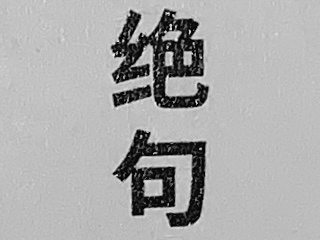
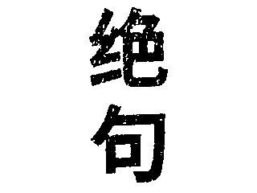
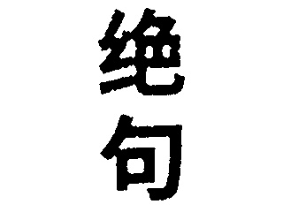
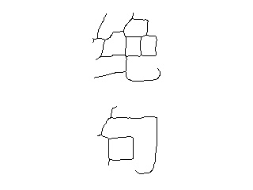

<center><h3>图像细化与骨架作业</h3></center>

<center>3190103683 张嘉浩</center>

#### 1. 实验要求

自选一幅灰度图像（最好是数字、文字图像，或具有细线条的图像），编程实现一下功能：

1. 选用一种图像二值化方法，实现图像二值化，提取前景目标；

2. 基于二值形态学滤波方法，二值化结果进行形态学滤波，实现小尺度噪点去除和孔洞填充；

3. 实践一种图像细化算法，实现前景目标细化。

要求提交原图像、二值化图像、形态学滤波结果图像和细化图像，以及自己编写的主要源码。

#### 2. 实验步骤

##### 2.1 otsu

otsu是阈值化中常用的自动确定阈值的方法之一，otsu 的算法试图找到一个阈值 (t)，以最小化由关系给出的加权类内方差：
$$
\sigma^2_w(t)=q_1(t)\sigma^2_1(t)+q_2(t)\sigma^2_2(t)
$$
其中：
$$
\begin{align*}
q_1(t)=\sum^{t}_{i=1} P(i)\ \ &\&\ \ q_2(t)=\sum^{I}_{i=t+1}P(i) \\
\mu_1(t)=\sum^{t}_{i=1}\frac{iP(i)}{q_1(t)}\ \ &\&\ \ \mu_2(t)=\sum^{I}_{i=t+1}\frac{iP(i)}{q_2(t)}\\
\sigma^2_1(t)=\sum^{t}_{i=1}[i−μ_1(t)]^2\frac{P(i)}{q_1(t)}\ \ &\&\ \ \sigma^2_1(t)=\sum^{I}_{i=t+1}[i−μ_2(t)]^2\frac{P(i)}{q_2(t)}\\
\end{align*}
$$
代码实现如下：

```python
hist_norm = hist.ravel()/hist.sum()
Q = hist_norm.cumsum()
bins = np.arange(256)
fn_min = np.inf
thresh = -1
for i in range(1, 256):
    p1, p2 = np.hsplit(hist_norm, [i])  # probabilities
    q1, q2 = Q[i], Q[255]-Q[i]  # cum sum of classes
    if q1 < 1.e-6 or q2 < 1.e-6:
        continue
    b1, b2 = np.hsplit(bins, [i])  # weights
    # finding means and variances
    m1, m2 = np.sum(p1*b1)/q1, np.sum(p2*b2)/q2
    v1, v2 = np.sum(((b1-m1)**2)*p1)/q1, np.sum(((b2-m2)**2)*p2)/q2
    # calculates the minimization function
    fn = v1*q1 + v2*q2
    if fn < fn_min:
        fn_min = fn
        thresh = i
# find otsu's threshold value with OpenCV function
ret, otsu = cv2.threshold(blur, 0, 255, cv2.THRESH_BINARY+cv2.THRESH_OTSU)
```


##### 2.2 形态学滤波

腐蚀可以用集合的方式定义，即
$$
X\ominus S=\{x\mid S+x\subseteq X\}
$$

```python
def erode(img):
    h, w = img.shape
    kernal = np.array(((0, 1, 0), (1, 0, 1), (0, 1, 0)), dtype=int)
    out = img.copy()
    tmp = out.copy()
    for x in range(1, h-1):
        for y in range(1, w-1):
            if np.sum(kernal * tmp[x-1:x+2, y-1:y+2]) < 255*4:
                out[x, y] = 0
    return out
```


膨胀用集合的方式定义如下：
$$
X\oplus S=\{S+x\cap X\ne \emptyset \}
$$

```python
def dilate(img):
    h, w = img.shape
    kernal = np.array(((0, 1, 0), (1, 0, 1), (0, 1, 0)), dtype=int)
    out = img.copy()
    tmp = out.copy()
    for x in range(1, h-1):
        for y in range(1, w-1):
            if np.sum(kernal * tmp[x-1:x+2, y-1:y+2]) >= 255:
                out[x, y] = 255
    return out
```


##### 2.3 图像细化

设已知目标点标记为1，背景点标记为0。边界点是指本身标记为1而其8连通邻域中至少有一个标记为0的点。算法对一幅图像的所有边界点即一个3×3区域都进行如下检验和操作：

**step 1** 考虑以边界点为中心的8邻域，设$p_1$为中心点，对其邻域的8个点逆时针绕中心点分别标记为$p_2,p_3,…,p_9$，其中$p_2$位于$p_1$的上方。如果$p_1=1$(即黑点)时，下面4个条件同时满足，则标记$p_1$为删除点(最后统一删除)： 

> 1. $2≤N(p_1)≤6$，其中$N(p_1)$是$p_1$的非零邻点的个数；
>
> 2. $S(p_1)=1$，其中$S(p_1)$是以$p_2,p_3,p_4,…,p_9$为序时这些点的值从0到1变化的次数；
>
> 3. $p_2p_6p_8=0$； 
>
> 4. $p_4p_6p_8=0$。 

```python
# step 1
for x in range(1, h-1):
    for y in range(1, w-1):
        if out[x, y] == 1:  # 如果是前景点
            num_of_one = np.sum(out[x-1:x+2, y-1:y+2])-1  # p1的非零邻点个数
            if num_of_one >= 2 and num_of_one <= 6:  # 如果p1的非零邻点个数在2到6之间
                if count(out, x, y) == 1:  # 若从0到1的变化次数为1
                    if out[x-1, y]*out[x+1, y]*out[x, y+1] == 0 and out[x, y-1]*out[x+1, y]*out[x, y+1] == 0:
                        delet_node1.append((x, y))  # 将当前点加入删除点list

for node in delet_node1:  # 对删除点list进行遍历
    out[node] = 0  # 将删除点设置为0
```

**step 2** 同 step 1，仅将3中的条件改为$p_2p_4p_6=0$，④中的条件改为$p_2p_4p_8=0$。同样当对所有边界点都检验完毕后，将所有满足条件的点删除。以上两步操作构成一次迭代。算法反复迭代，直至没有点再满足标记删除的条件，这时剩下的点就组成区域的骨架。

```python
# step 2
for x in range(1, h-1):
    for y in range(1, w-1):
        if out[x, y] == 1:  # 如果是前景点
            num_of_one = np.sum(out[x-1:x+2, y-1:y+2])-1  # p1的非零邻点个数
            if num_of_one >= 2 and num_of_one <= 6:  # 如果p1的非零邻点个数在2到6之间
                if count(out, x, y) == 1:  # 若从0到1的变化次数为1
                    if out[x-1, y]*out[x, y-1]*out[x+1, y] == 0 and out[x-1, y]*out[x, y-1]*out[x, y+1] == 0:
                        delet_node2.append((x, y))  # 将当前点加入删除点list

for node in delet_node2:  # 对删除点list进行遍历
    out[node] = 0  # 将删除点设置为0
```


#### 3. 实验结果与讨论

选取的图片如图1所示，用otsu法得到的结果如图2所示，形态学滤波之后的结果如图3，最后得到的骨架如图4。

           

<center>图1. 测试图&ensp; &ensp; &ensp; &ensp; &ensp; &ensp; &ensp; &ensp; &ensp; &ensp; &ensp; &ensp; &ensp; &ensp; &ensp; &ensp; &ensp; &ensp; &ensp; &ensp; &ensp; &ensp; &ensp; &ensp; 图2. otsu结果图</center>

        

<center>图3. 形态学滤波&ensp; &ensp; &ensp; &ensp; &ensp; &ensp; &ensp; &ensp; &ensp; &ensp; &ensp; &ensp; &ensp; &ensp; &ensp; &ensp; &ensp; &ensp; &ensp; &ensp; &ensp; &ensp; &ensp; 图4. 图像骨架</center>

#### 附录：源代码

```python
import cv2
import numpy as np

# for filter


def erode(img):
    h, w = img.shape
    kernal = np.array(((0, 1, 0), (1, 0, 1), (0, 1, 0)), dtype=int)
    out = img.copy()
    tmp = out.copy()
    for x in range(1, h-1):
        for y in range(1, w-1):
            if np.sum(kernal * tmp[x-1:x+2, y-1:y+2]) < 255*4:
                out[x, y] = 0
    return out


def dilate(img):
    h, w = img.shape
    kernal = np.array(((0, 1, 0), (1, 0, 1), (0, 1, 0)), dtype=int)
    out = img.copy()
    tmp = out.copy()
    for x in range(1, h-1):
        for y in range(1, w-1):
            if np.sum(kernal * tmp[x-1:x+2, y-1:y+2]) >= 255:
                out[x, y] = 255
    return out


def refine(img):
    h, w = img.shape
    out = np.zeros((h, w), dtype=int)
    out[img > 0] = 1      # chage scare to [0,1]
    out = 1-out           # reverse

    while True:
        delet_node1 = []
        delet_node2 = []

        # step 1
        for x in range(1, h-1):
            for y in range(1, w-1):
                if out[x, y] == 1:  # 如果是前景点
                    num_of_one = np.sum(out[x-1:x+2, y-1:y+2])-1  # p1的非零邻点个数
                    if num_of_one >= 2 and num_of_one <= 6:  # 如果p1的非零邻点个数在2到6之间
                        if count(out, x, y) == 1:  # 若从0到1的变化次数为1
                            if out[x-1, y]*out[x+1, y]*out[x, y+1] == 0 and out[x, y-1]*out[x+1, y]*out[x, y+1] == 0:
                                delet_node1.append((x, y))  # 将当前点加入删除点list

        for node in delet_node1:  # 对删除点list进行遍历
            out[node] = 0  # 将删除点设置为0

        # step 2
        for x in range(1, h-1):
            for y in range(1, w-1):
                if out[x, y] == 1:  # 如果是前景点
                    num_of_one = np.sum(out[x-1:x+2, y-1:y+2])-1  # p1的非零邻点个数
                    if num_of_one >= 2 and num_of_one <= 6:  # 如果p1的非零邻点个数在2到6之间
                        if count(out, x, y) == 1:  # 若从0到1的变化次数为1
                            if out[x-1, y]*out[x, y-1]*out[x+1, y] == 0 and out[x-1, y]*out[x, y-1]*out[x, y+1] == 0:
                                delet_node2.append((x, y))  # 将当前点加入删除点list

        for node in delet_node2:  # 对删除点list进行遍历
            out[node] = 0  # 将删除点设置为0

        if len(delet_node1) == 0 and len(delet_node2) == 0:
            break

    out = 1 - out  # 取反
    out = out.astype(np.uint8) * 255  # 转换为0和255

    return out


def count(img, x, y):
    num = 0
    if (img[x-1, y-1] - img[x-1, y]) == 1:  # p2到p3
        num += 1
    if (img[x, y-1] - img[x-1, y-1]) == 1:  # p3到p4
        num += 1
    if (img[x+1, y-1] - img[x, y-1]) == 1:  # p4到p5
        num += 1
    if (img[x+1, y] - img[x+1, y-1]) == 1:  # p5到p6
        num += 1
    if (img[x+1, y+1] - img[x+1, y]) == 1:  # p6到p7
        num += 1
    if (img[x, y+1] - img[x+1, y+1]) == 1:  # p7到p8
        num += 1
    if (img[x-1, y+1] - img[x, y+1]) == 1:  # p8到p9
        num += 1
    if (img[x-1, y] - img[x-1, y+1]) == 1:  # p9到p2
        num += 1
    return num


img = cv2.imread("./image.jpg", 0)
blur = cv2.GaussianBlur(img, (5, 5), 0)

# otsu part

# find normalized_histogram, and its cumulative distribution function
hist = cv2.calcHist([blur], [0], None, [256], [0, 256])
hist_norm = hist.ravel()/hist.sum()
Q = hist_norm.cumsum()
bins = np.arange(256)
fn_min = np.inf
thresh = -1
for i in range(1, 256):
    p1, p2 = np.hsplit(hist_norm, [i])  # probabilities
    q1, q2 = Q[i], Q[255]-Q[i]  # cum sum of classes
    if q1 < 1.e-6 or q2 < 1.e-6:
        continue
    b1, b2 = np.hsplit(bins, [i])  # weights
    # finding means and variances
    m1, m2 = np.sum(p1*b1)/q1, np.sum(p2*b2)/q2
    v1, v2 = np.sum(((b1-m1)**2)*p1)/q1, np.sum(((b2-m2)**2)*p2)/q2
    # calculates the minimization function
    fn = v1*q1 + v2*q2
    if fn < fn_min:
        fn_min = fn
        thresh = i
# find otsu's threshold value with OpenCV function
ret, otsu = cv2.threshold(blur, 0, 255, cv2.THRESH_BINARY+cv2.THRESH_OTSU)
print("{} {}".format(thresh, ret))
# convert
result_img = img.copy()
for x in range(0, img.shape[0]):
    for y in range(0, img.shape[1]):
        if result_img[x][y] < thresh:
            result_img[x][y] = 0
        else:
            result_img[x][y] = 255
# save image
# cv2.imshow("otsu_result", result_img)
cv2.imwrite("otsu_result.jpg", result_img)

# dilate and erode
dilate_result = dilate(result_img)
erode_result = erode(dilate_result)
erode_result = erode(erode_result)
erode_result = erode(erode_result)
dilate_result = dilate(erode_result)
dilate_result = dilate(dilate_result)

# cv2.imshow("res", dilate_result)
cv2.imwrite("filter_result.jpg", dilate_result)


result = refine(dilate_result)

cv2.imshow("res", result)
cv2.waitKey(0)
cv2.imwrite("refined_img.jpg", result)
```


