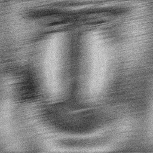

<center><h3>图像复原作业</h3></center>

<center>3190103683 张嘉浩</center>

#### 1. 实验要求

附件文件图像是长度为30、逆时针方向角度为11、加有高斯白噪声的移动模糊图像。试用一种方法复原该图像。

#### 2. 实验步骤

##### 2.1 维纳滤波

维纳滤波是使得原始图像与复原图像之间的均方误差$e^2=E\{|f-\hat{f}|^2\}$最小的复原方法，其频域计算式为：

$$
F(u, v)=\frac{H(u, v) ^*}{H^{2}(u, v)+K} G(u, v)
$$
其中$F(u,v), H(u,v),G(u,v)$分别是清晰复原图的频谱，模糊核的频谱以及模糊图的频谱，$K$是噪声抑制因子。

复原后的图像即为：
$$
\hat{f}(x, y)=\mathcal{F}^{-1}[F(u,v)]
$$

##### 2.2 点扩展函数

进行维纳滤波的关键是要知道退化函数$H(u,v)$，而$H(u,v)$即为点扩展函数$PSF$的傅立叶变换。对于运动模糊图片来说，其点扩展函数是一条由图像中点出发，沿模糊方向有一定长度的线段。由于本例已经给出了运动模糊的长度和角度，因此能够很容易地写出点扩展函数，只需要在黑色(值为0)背景中，将位于点扩展函数线段上的点置为1，然后再做归一化即可。因此，对本例的模糊图像进行复原是容易的。

#### 3. 实验结果与讨论

实验结果如下：

                                                  

<center>图1. 测试图&ensp; &ensp; &ensp; &ensp;&ensp; &ensp; &ensp; &ensp; &ensp; &ensp; &ensp; &ensp; &ensp; &ensp; &ensp; &ensp; &ensp; &ensp; &ensp; &ensp; &ensp; &ensp; &ensp; &ensp; &ensp; &ensp; &ensp; &ensp; &ensp; &ensp; &ensp; &ensp; 图2. 维纳滤波结果图</center>

#### 附录：源代码

```python
import cv2
import math
import numpy as np

image = cv2.imread("./hw.bmp", 0)
length = 30 
angle = 11
angle = angle * math.pi / 180 

# calculate PSF
PSF = np.zeros(image.shape) 
h, w = image.shape
x_center = int((h - 1) / 2)
y_center = int((w - 1) / 2)

for i in range(length):
    delta_x = round(math.sin(angle) * i)
    delta_y = round(math.cos(angle) * i)
    PSF[int(x_center - delta_x), int(y_center + delta_y)] = 1

PSF = PSF / np.sum(PSF)  # normalizatio

G = np.fft.fft2(image)  # fast fourier transform 
H = np.fft.fft2(PSF)
K = 0.015 # set K

# wiener filiter
wiener_fft = np.conj(H) / (np.abs(H) ** 2 + K) 
F = wiener_fft * G
f = np.fft.ifftshift(np.fft.ifft2(F))  
f = f.real
f = f.astype(np.uint8)  

cv2.imshow("restoreImag",f)
cv2.waitKey(0)
cv2.imwrite("restoreImage.png", f)
```


