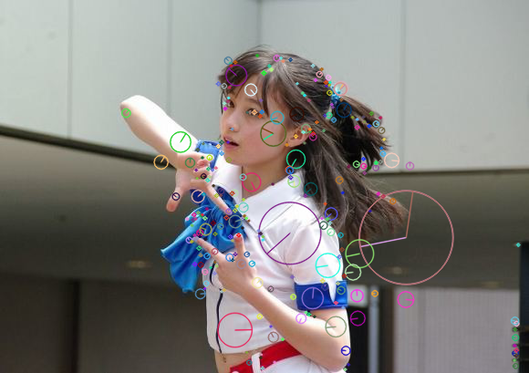

<center><h3>图像特征提取算法比较</h3></center>

<center>3190103683 张嘉浩</center>

#### 1. 实验要求

编程实现（可以调用opencv库）SIFT、SURF、ORB等图像特征提取算法，并比较各算法性能。

#### 2. 实验步骤

##### 2.1 SIFT特征提取

1. 尺度空间极值检测：搜索所有尺度上的图像位置。通过高斯微分函数来识别潜在的对于尺度和旋转不变的兴趣点。
2. 关键点定位：在每个候选的位置上，通过一个拟合精细的模型来确定位置和尺度。关键点的选择依据于它们的稳定程度。
3. 方向确定：基于图像局部的梯度方向，分配给每个关键点位置一个或多个方向。所有后面的对图像数据的操作都相对于关键点的方向、尺度和位置进行变换，从而提供对于这些变换的不变性。
4. 生成描述子：在每个关键点周围的邻域内，在选定的尺度上测量图像局部的梯度。这些梯度被变换成一种描述子，这种描述子允许比较大的局部形状的变形和光照变化。

```python
feature = 300  # 设置特征点数量
sift = cv2.xfeatures2d.SIFT_create(feature)  # 创建SIFT对象
kp = sift.detect(gray, None)  # 寻找关键点
keypoint = cv2.drawKeypoints(
    origin, kp, None, flags=cv2.DRAW_MATCHES_FLAGS_DRAW_RICH_KEYPOINTS)  # 绘制关键点
```

##### 2.2 SURF特征提取

1. 构造Hessian矩阵，计算变换图：
$$
  \mathcal{H}(\mathrm{x}, \sigma)=\left[\begin{array}{ll}
  L_{x x}(\mathrm{x}, \sigma) & L_{x y}(\mathrm{x}, \sigma) \\
  L_{x y}(\mathrm{x}, \sigma) & L_{y y}(\mathrm{x}, \sigma)
  \end{array}\right]
$$

$$
  \operatorname{det}\left(H_{a p p r o x}\right)=\mathrm{L}_{x x} \mathrm{~L}_{y y}-\left(0.9 \mathrm{~L}_{x y}\right)^{2}
$$

2. 定位特征点：设置阈值，确定候选兴趣点，将经过Hessian矩阵处理过的每个像素点与其三维邻域的26个点进行大小比较，采用拟合3D二次曲线内插子像素进行精确定位。

3. 确定特征点主方向：以特征点为中心，计算半径为$6\sigma$的邻域内，统计60度扇形内所有点在水平和垂直方向的Haar小波响应总和，并给这些响应值赋高斯权重系数，然后60度范围内的响应相加以形成新的矢量，遍历整个圆形区域，选择最长矢量的方向。
4. 构造特征描述子：在特征点周围取一个正方形框，框的边长为$20\sigma$。然后把该框分为16个子区域，每个子区域统计25个像素的x方向和y方向的haar小波特征。

```python
HessianThreshold = 5200  # 设置阈值
surf = cv2.xfeatures2d.SURF_create(HessianThreshold)  # 创建SURF对象
kp = surf.detect(gray, None)  # 寻找关键点
keypoint = cv2.drawKeypoints(
    origin, kp, None, flags=cv2.DRAW_MATCHES_FLAGS_DRAW_RICH_KEYPOINTS)  # 绘制关键点
```

##### 2.3 ORB

​		ORB(Oriented FAST and Rotated BRIEF)算法结合了FAST与BRIEF算法，并给FAST特征点增加了方向性，使得特征点具有旋转不变性，并提出了构造金字塔方法，解决尺度不变性。其中，特征提取是由FAST算法发展而来的，特征描述是根据BRIEF算法改进的。ORB特征是将FAST特征点的检测方法与BRIEF特征描述子结合起来，并在它们原来的基础上做了改进与优化。ORB主要解决BRIEF描述子不具备旋转不变性的问题。

```python
fearure = 300  # 设置特征点数量
orb = cv2.ORB_create(fearure)  # 创建ORB对象
kp = orb.detect(image, None)  # 寻找关键点
keypoint = cv2.drawKeypoints(
    image, kp, None, flags=cv2.DRAW_MATCHES_FLAGS_DRAW_RICH_KEYPOINTS)  # 绘制关键点
```

#### 3. 实验结果与讨论

##### 3.1 实验结果

              

<center>Fig1. Origin Image &ensp;&ensp; &ensp; &ensp;&ensp; &ensp;&ensp; &ensp; &ensp; &ensp; &ensp; &ensp; &ensp; &ensp; &ensp; &ensp; &ensp; &ensp; &ensp; &ensp; &ensp; &ensp; &ensp; &ensp; &ensp; &ensp;Fig2. SIFT Result</center>

              

<center>Fig3. SURF Result &ensp;&ensp;&ensp; &ensp; &ensp;&ensp; &ensp; &ensp; &ensp; &ensp; &ensp; &ensp; &ensp; &ensp; &ensp; &ensp; &ensp; &ensp; &ensp; &ensp; &ensp; &ensp; &ensp; &ensp; &ensp; &ensp;Fig4. ORB Result</center>

##### 3.2 算法比较分析

| 算法 | 特点                           |
| ---- | ------------------------------ |
| SIFT | 特征点小且分散，但耗费时间较长 |
| SURF | 特征点大且分散，运算速度较快   |
| ORB  | 特征较大且集中，运算速度非常快 |

#### 附录：源代码

`sift.py`

```python
import cv2

origin = cv2.imread('RawImg.jpeg')  # 读取图片
gray = cv2.cvtColor(origin, cv2.COLOR_BGR2GRAY)  # 将图片转为灰度图

feature = 300  # 设置特征点数量
sift = cv2.xfeatures2d.SIFT_create(feature)  # 创建SIFT对象
kp = sift.detect(gray, None)  # 寻找关键点
keypoint = cv2.drawKeypoints(
    origin, kp, None, flags=cv2.DRAW_MATCHES_FLAGS_DRAW_RICH_KEYPOINTS)  # 绘制关键点

cv2.imshow("result", keypoint)
cv2.waitKey(0)
cv2.imwrite("sift_result.png", keypoint)
```

`surf.py`

```python
import cv2

origin = cv2.imread('RawImg.jpeg')  # 读取图片
gray = cv2.cvtColor(origin, cv2.COLOR_BGR2GRAY)  # 将图片转为灰度图

HessianThreshold = 5500  # 设置阈值
surf = cv2.xfeatures2d.SURF_create(HessianThreshold)  # 创建SURF对象
kp = surf.detect(gray, None)  # 寻找关键点
keypoint = cv2.drawKeypoints(
    origin, kp, None, flags=cv2.DRAW_MATCHES_FLAGS_DRAW_RICH_KEYPOINTS)

cv2.imshow("result", keypoint)
cv2.waitKey(0)
cv2.imwrite("surf_result.png", keypoint)
```

`orb.py`

```python
import cv2

image = cv2.imread('RawImg.jpeg')  # 读取图片

fearure = 300  # 设置特征点数量
orb = cv2.ORB_create(fearure)  # 创建ORB对象
kp = orb.detect(image, None)  # 寻找关键点
keypoint = cv2.drawKeypoints(
    image, kp, None, flags=cv2.DRAW_MATCHES_FLAGS_DRAW_RICH_KEYPOINTS)  # 绘键

cv2.imshow("result", keypoint)
cv2.waitKey(0)
cv2.imwrite("orb_result.png", keypoint)
```


